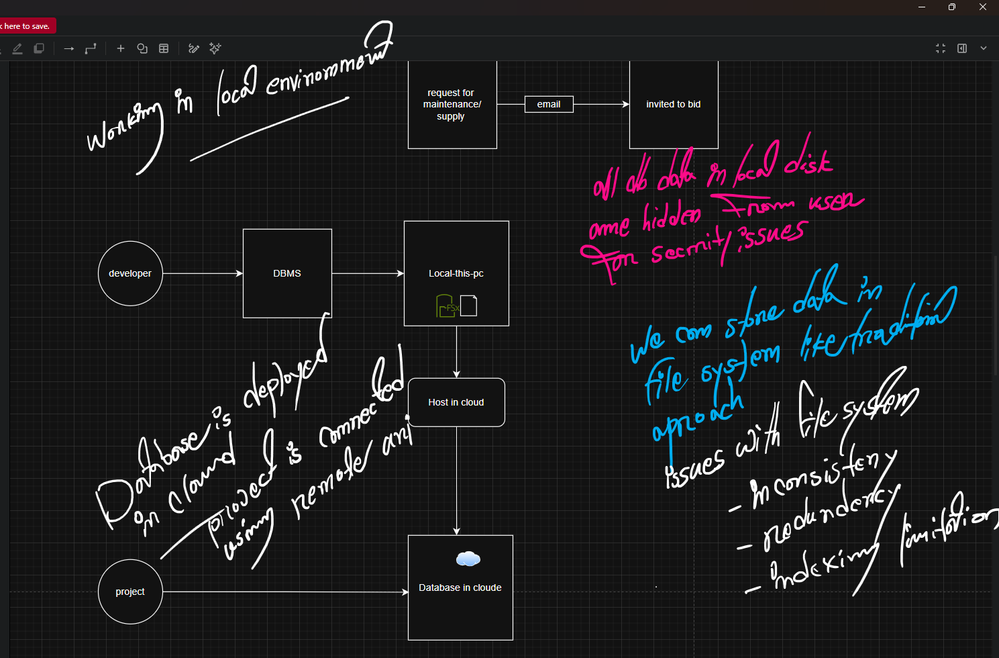
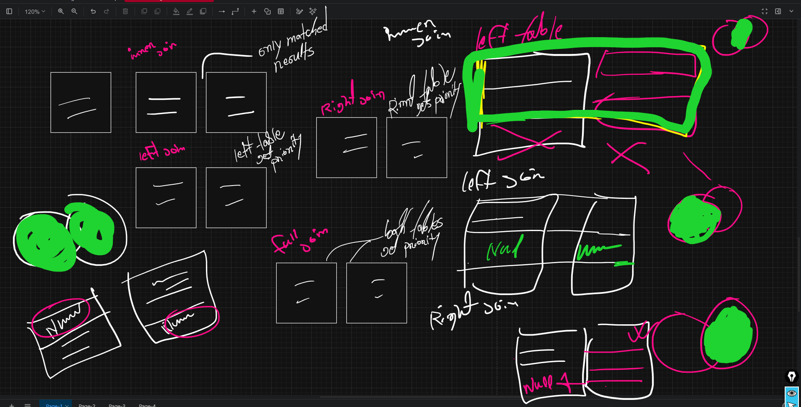
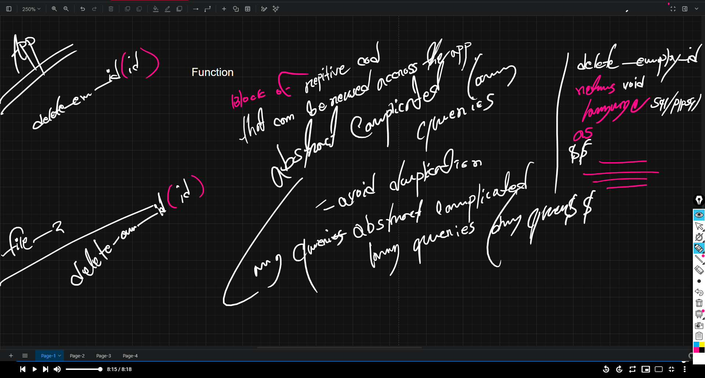
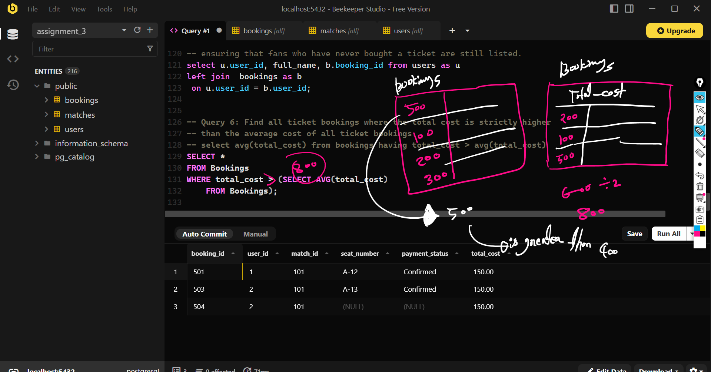

# AI-Driven Software Engineering — Next Level

**Author:** Shakil Ahmmed

A structured learning repository covering backend engineering, database design, and AI-assisted development practices. Built through hands-on assignments progressing from Node.js fundamentals to production-grade Express APIs and PostgreSQL database systems.

## Stack & Technologies

- **Runtime:** Node.js
- **Framework:** Express.js (TypeScript)
- **Database:** PostgreSQL
- **Auth:** JWT + bcrypt
- **Build:** tsup
- **Deployment:** Vercel

## Repository Structure

```
src/
├── node/               # Node.js fundamentals
├── express/            # Production Express REST API (JWT auth, PostgreSQL)
├── all-assignments/    # Course assignments
│   ├── assignment-two/ # TypeScript + Node exercises
│   └── assignment_3/   # PostgreSQL DB design & SQL queries
└── visuals/            # Reference diagrams & learning visuals
```

## Visuals & Reference Diagrams

### Database: File System vs Hosted



### SQL Joins — Inner, Left, Right, Full



### SQL Functions Reference



### Subquery Patterns


